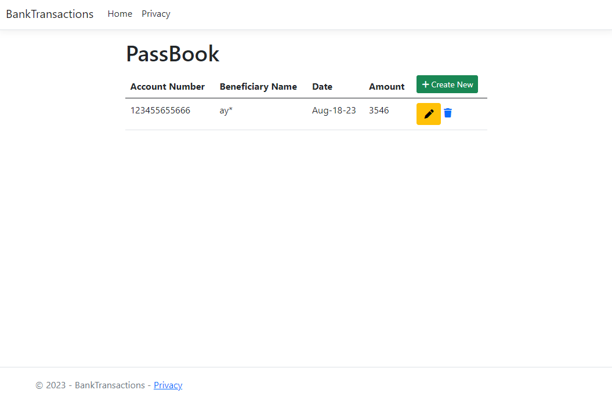
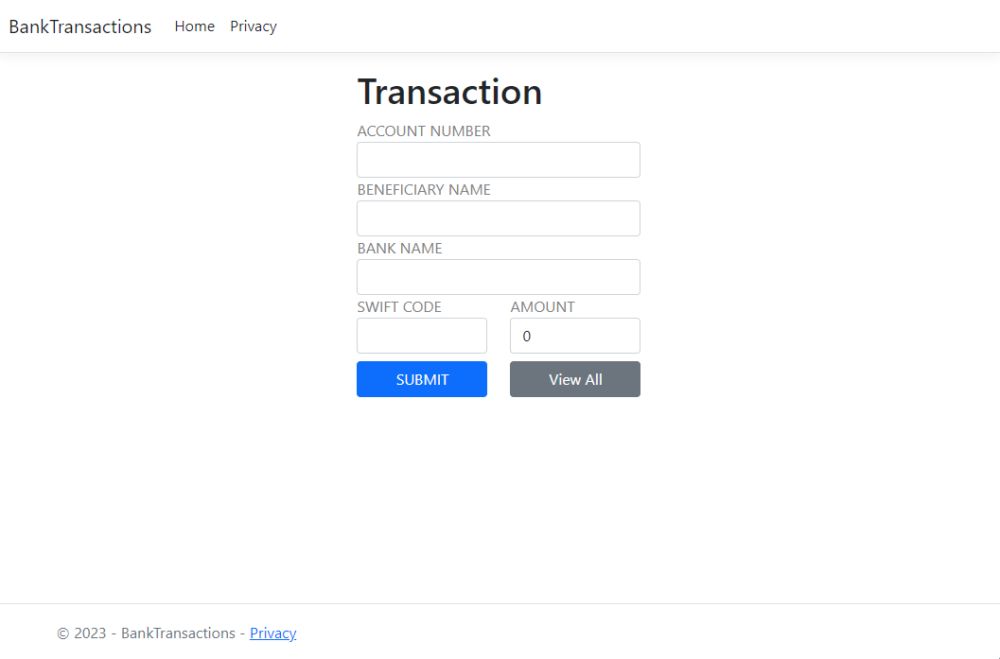
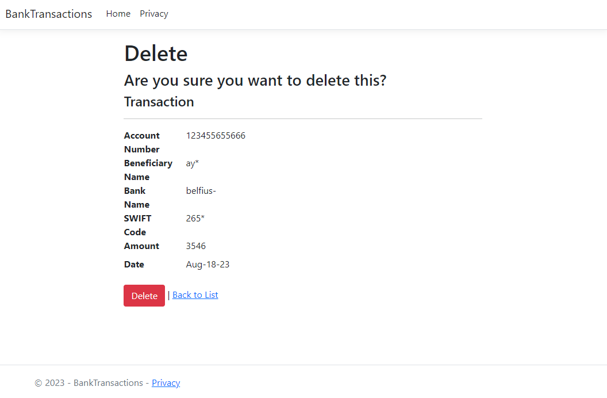

# Projectnaam

BankMemberManager

## Projectbeschrijving

BankMemberManager is een applicatie ontwikkeld met ASP.NET Core MVC en EF Core. Het biedt functionaliteit voor het beheer van bankleden, inclusief het toevoegen, weergeven, bijwerken en verwijderen van transactiegegevens. Met deze applicatie kunnen gebruikers efficiënt financiële transacties en ledenbeheer uitvoeren.

## Installatie-instructies

Volg deze stappen om de BankMemberManager-applicatie op je lokale machine te installeren:

1. Zorg ervoor dat je de juiste versie van .NET Core SDK hebt geïnstalleerd.
2. Clone dit repository naar je lokale machine.
3. Navigeer naar de hoofdmap van de applicatie in de terminal.
4. Voer `dotnet restore` uit om de benodigde pakketten te herstellen.
5. Configureer je databaseverbinding in het `appsettings.json`-bestand.
6. Voer `dotnet ef database update` uit om de database te migreren.
7. Start de applicatie met het commando `dotnet run`.

## Gebruiksaanwijzing

Volg deze stappen om de BankMemberManager-applicatie te gebruiken:

1. Open je webbrowser en navigeer naar `http://localhost:5000`.
2. Bekijk de lijst met transactiegegevens op de startpagina.
3. Klik op "Create New" om nieuwe transactiegegevens toe te voegen.
4. Vul de vereiste gegevens in het formulier in en klik op "Submit" om een nieuwe transactie toe te voegen.
5. Klik op "View All" om alle bestaande transacties te bekijken.
6. Voor het bijwerken of verwijderen van een transactie, klik op de respectieve knoppen naast de transactie.

Dit zijn de basisstappen om de BankMemberManager-applicatie te installeren en te gebruiken. Pas de instructies aan op basis van je omgeving en behoeften.

## Stappen voor het Ontwikkelen van een Bankledenbeheer CRUD Toepassing met ASP.NET Core MVC en EF Core

1. Maak een MVC-project
2. Definieer een EF Core-model
3. Afhankelijkheidsinjectie
4. DB Verbindingsreeks
5. Database Migratie
6. Creëer een MVC-controller
7. Layout Pagina
8. Invoegoperatie
9. Formuliervalidatie in MVC
10. Formulierinzending
11. Toon Bestaande Gegevens
12. Update-operatie
13. Verwijder Operatie

## Voorbeelden

### Tabel voor Weergave van Transactiegegevens

Deze tabel toont transactiegegevens van bankleden binnen de applicatie. Hier zijn enkele van de gegevensvelden die worden weergegeven:

- Rekeningnummer
- Begunstigde Naam
- Datum
- Bedrag

De tabel bevat ook actieknoppen voor elke transactie:

- **Wijzigen**: De knop met het potloodpictogram stelt gebruikers in staat om de transactiegegevens te wijzigen. Wanneer gebruikers op deze knop klikken, worden ze naar de bewerkingspagina geleid.
- **Verwijderen**: De knop met het prullenbakpictogram biedt gebruikers de mogelijkheid om een transactie te verwijderen. Wanneer gebruikers op deze knop klikken, wordt de betreffende transactie uit de lijst verwijderd.

De tabel en de bijbehorende knoppen helpen gebruikers bij het beheren van transactiegegevens binnen de app.

### Formulier voor aanmaak nieuwe leden
 
- Rekeningnummer
- Begunstigde Naam
- Banknaam
- SWIFT-code
- Bedrag

Gebruikers vullen deze velden in met de relevante transactiegegevens voordat ze de transactie indienen.

Dit gedeelte van het formulier biedt twee knoppen voor acties:

- **Submit**: Deze knop wordt gebruikt om de ingevoerde transactiegegevens te verzenden voor verwerking. Wanneer gebruikers op deze knop klikken, worden de ingevulde gegevens verstuurd voor verwerking.

- **View All**: Deze knop geeft gebruikers de mogelijkheid om alle bestaande transacties te bekijken. Wanneer gebruikers op deze knop klikken, worden ze naar een overzichtspagina geleid waar ze alle transacties kunnen zien.

### Details van Transactiegegevens en Verwijderformulier

In deze sectie worden details van transactiegegevens weergegeven in een gestructureerde lijst met definitielijsten (`<dl>`). De weergegeven gegevens omvatten:

- **Rekeningnummer**
- **Begunstigde Naam**
- **Banknaam**
- **SWIFT-code**
- **Bedrag**
- **Datum**

Elke gegevenswaarde wordt weergegeven naast de bijbehorende definitiekop, en dit helpt bij een duidelijke presentatie van de transactie-informatie.

Onder de definitielijsten is er ook een verwijderformulier aanwezig. Het formulier is bedoeld voor het verwijderen van een specifieke transactie. Gebruikers kunnen de gewenste transactie selecteren en vervolgens op de "Delete" knop klikken om deze te verwijderen. Een link naar de lijstweergave is ook aanwezig om terug te keren naar het overzicht.

Deze sectie geeft gebruikers de mogelijkheid om details van een specifieke transactie te bekijken en indien nodig te verwijderen.

